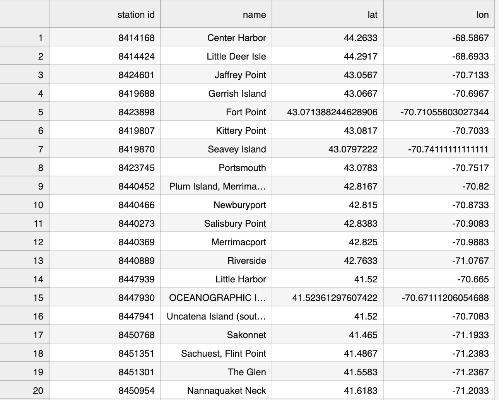
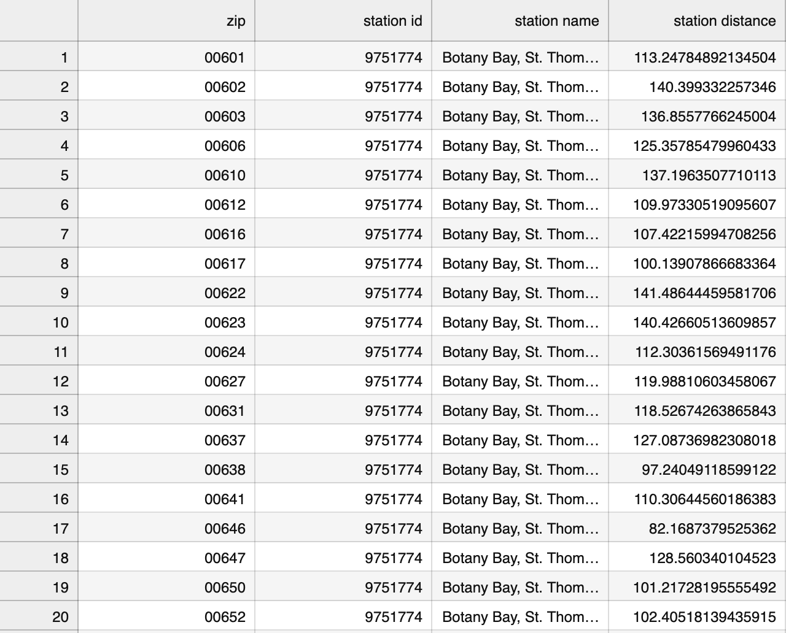

# yorkvj-is426-final
 
### Introduction 

This purpose of this project is to take a zip code from the user and print out the where the closest weather station with tide data is, using the tide stations from the National Oceanic and Atmospheric Administration (NOAA) website. Using the data from this station the program will also print when the next tide will occur, if it is a high or low tide, how much the water level will change, and the distance the station is from the center of the zip code. 

### The process

Orginally I planned on taking data from the following website: 
https://tidesandcurrents.noaa.gov/

The orginal code I had for this website is in the first_try.ipynb file. This code takes in a station id and prints the next tide for that station. This ended up not working since this website did not have latitudes and longitudes linked to the site. I got the latitudes and longitudes of the stations from the following site: 
https://tidesandcurrents.noaa.gov/tide_predictions.html

Unfortunately the seccond and first site had different station ids so I was unable to connect data from the two sites. 

### Setting up the stations file
To see the code that I used to make my station file look at the file titled setting_up_the_station_file.ipynb.

The purpose of this code is to take the station ids, station names and their corresponding latitudes and longitudes from the seccond website. The code then puts this data into a csv file to reference later. 

To do this I first got all the group ids and group name for the stations. Within each group id there are numerous stations. Once I had a dictionary of all the group ids and group names I iterated through the group ids. I then used the group ids to put each one into a link and from there I loaded all of the data into a list of dictionaries using json. I was then able to find station id, station name, latitude and longitude for all the stations. I filtered out stations without a station id and wrote the rest to my csv. 

Here is what the csv file looks like: 

### Setting up the closest_zip file
To see this code that I used to make my station file look at the file titled setting_up_the_closest_zip_file.ipynb. 

For this code I downloaded a csv file of zip codes and their latitudes and longitudes from the following site:
https://gist.github.com/erichurst/7882666

With this file and the stations file that I made I was able to find what station was closest to each zip code. Once I had this data I wrote it to my csv file. 

To do this I stored the data from both the station file and the zip code file in two seprate dictionaries. Then I iterated through the zip codes, resetting the temporary distance to 1000000000000 and the temporary zip, temporary station name and temporary station id to None each time a new zip code went through. For every zip code I iterated through the stations. I then calculated how far this station and zip were from eachother. If this value was smaller than the current tempary zip that station's name and id are made the temporary station name and temporary station id and the distance between the station and the zip code is made the temporary distance. Once the loop goes through all the stations it will write the temporary distance, temporary zip, temporary station name and temporary station id to the csv file. This will be the data of the station closest to the zip code. The program will do this process for all the zip codes. 

Here is what the csv file looks like: 

### Printing the tide data
To see this code that I used to print the tide data look at the file titled printing_the_tide_data.ipynb.

The purpose of this program is to take a zip code form the user, match this to a station id then put the station id into the tide website and return data about the next tide. 

To do this I first asked the user what zip code they wanted to find data on. I then loaded the data from the closest_zip csv into a list of dictionaries. Then I set the station to None and iterated through the zip codes in the list of dictionaries to find a matching zip code to the one the user gave. Once a matching zip code was found I set the station id equal to station and broke out of the loop. If the station was still None after going through this loop I printed an error message to the user stating: Error: zip code does not exist. If the station was not None I used the date time libary to get the current time and the time 3 days from now. With the station id, current time and time in 3 days I was able to put these in a link to get the tide data for the current day and next 3 days. I then loaded this data into a list of dictionaries and iterated through it to find the first data point that was past the current time. I then printed the closest station name, the distance this station is from the zip code, when the next tide will happen, if it is a high or low tide and how much the water level will change. 

Here are some example zip codes and the output of the program when it ran at 2022-12-11 23:10: 

Potsdam, NY (13676):

The closest station is Dover, Cocheco River and is 225.63743005214764 miles away.
The next tide will happen at 2022-12-12 03:12 and will be a high tide. The water level will change by 6.235 feet.

Los Angeles, CA (90001):

The closest station is MONTEREY, MONTEREY BAY and is 274.1569585183597 miles away.
The next tide will happen at 2022-12-12 02:41 and will be a high tide. The water level will change by 3.828 feet.

Denver, CO (80014):

The closest station is New Hope Bridge and is 899.1994810031485 miles away.
The next tide will happen at 2022-12-12 03:47 and will be a low tide. The water level will change by -0.068 feet.